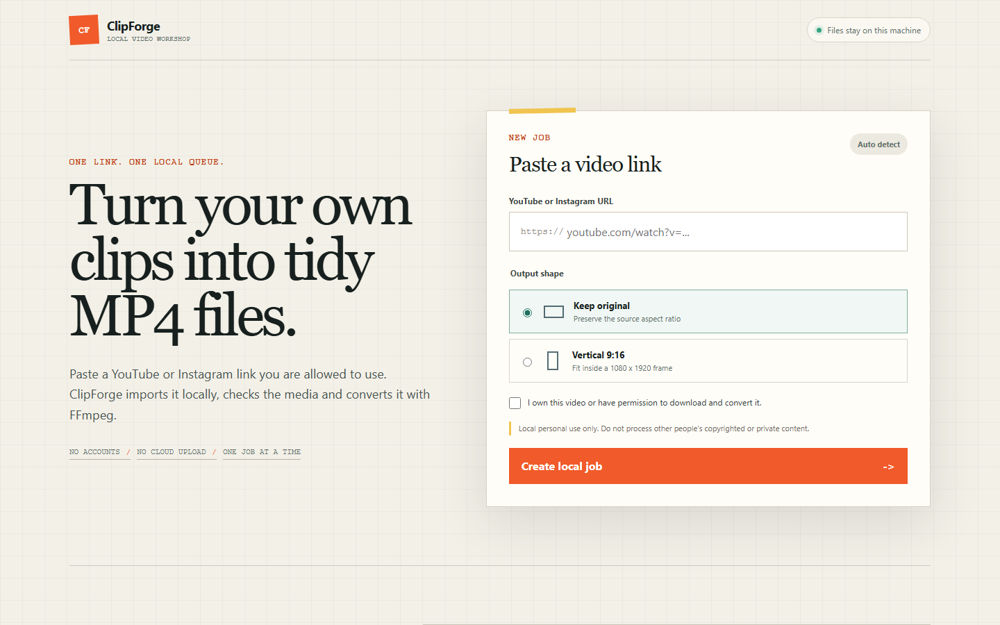
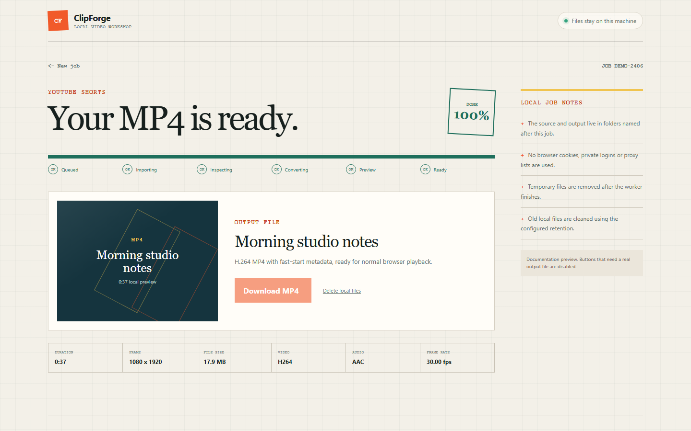

# ClipForge Local

A small local-first TypeScript app for importing a single permitted YouTube or
Instagram video and converting it to a browser-friendly MP4 with FFmpeg.

The project is intentionally private and local. It does not support playlists,
profile downloads, private-content access, cookie uploads, proxies or account
automation.





## What is inside

- `apps/desktop` - Electron launcher and in-process desktop job queue
- `apps/web` - Next.js user interface
- `apps/api` - Fastify HTTP API and guarded local file routes
- `apps/worker` - BullMQ worker, yt-dlp adapter, FFprobe and FFmpeg pipeline
- `packages/shared` - shared schemas, job types and URL normalization
- `data` - job-specific downloads, outputs, temporary files and logs

## Desktop release

Desktop releases include Node.js, FFmpeg, FFprobe and yt-dlp. Docker and Redis
are not required when using these packages.

- Windows: run the portable `.exe`.
- Ubuntu: install the `.deb`, or mark the `.AppImage` executable and run it.
- openSUSE: install the `.rpm`, or use the same `.AppImage`.

The packages are unsigned personal-project builds, so Windows or Linux may show
a publisher warning. Download them only from this repository's Releases page.

Packaged output is stored in the operating system's application-data directory.
The desktop build uses an in-process queue with one conversion at a time. Redis
and BullMQ remain part of the development/server architecture below.

## Requirements

- Node.js 20.9 or newer
- Docker Desktop, or another Redis server reachable at `REDIS_URL`
- FFmpeg and FFprobe in `PATH`
- yt-dlp in `PATH`

On Windows, check the machine before starting:

```powershell
npm run check:tools
```

## Start locally

```powershell
Copy-Item .env.example .env
npm install
docker compose up -d redis
npm run dev
```

Open [http://localhost:3000](http://localhost:3000).

The web app runs on port `3000`, the API on `4100`, and the worker consumes the
`video-import` queue. Conversion concurrency defaults to one job because video
encoding is CPU-heavy.

## Useful commands

```powershell
npm test
npm run typecheck
npm run build
npm run package:win
npm run dev:web
npm run dev:api
npm run dev:worker
```

Linux release builds use:

```bash
npm run package:linux
```

## Job flow

1. The browser validates the basic form and asks for an ownership or permission
   confirmation.
2. The API validates the request again, normalizes the URL and creates a BullMQ
   job.
3. The worker imports one source with yt-dlp and writes it to a job-specific
   folder.
4. FFprobe checks streams, duration, size, codecs and dimensions.
5. FFmpeg creates H.264 video, optional AAC audio and MP4 fast-start metadata.
6. The worker creates a JPEG preview, stores metadata and marks the job ready.
7. The API serves only the known `output.mp4` for that UUID.

The vertical option fits the source inside a black `1080 x 1920` frame without
cropping it.

## Local data

Generated media is ignored by Git:

```text
data/
  downloads/<job-id>/
  logs/<job-id>/job.log
  outputs/<job-id>/output.mp4
  outputs/<job-id>/thumbnail.jpg
  temp/<job-id>/
```

Use the delete button to remove a job immediately. The worker also deletes old
job folders according to `CLEANUP_AGE_HOURS`.

## Important boundary

The permission checkbox records intent; it does not grant rights or override a
platform's terms. Use ClipForge only for videos you own or are authorized to
download and convert. Import failures for unavailable, private, restricted or
unsupported media are expected.

This is a learning project and a personal local tool, not a hosted downloading
service.
